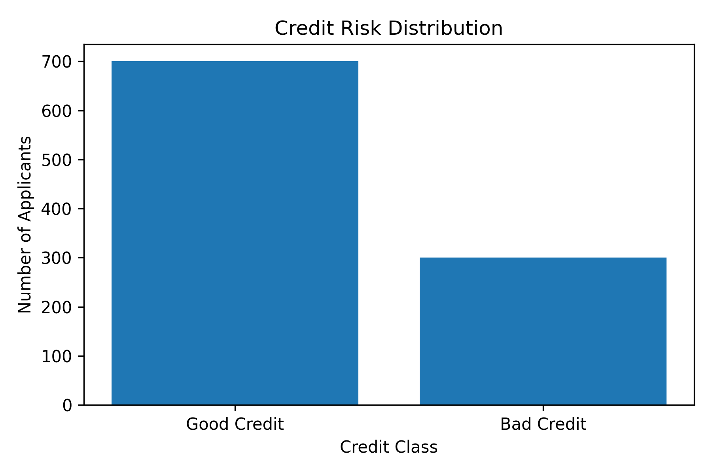
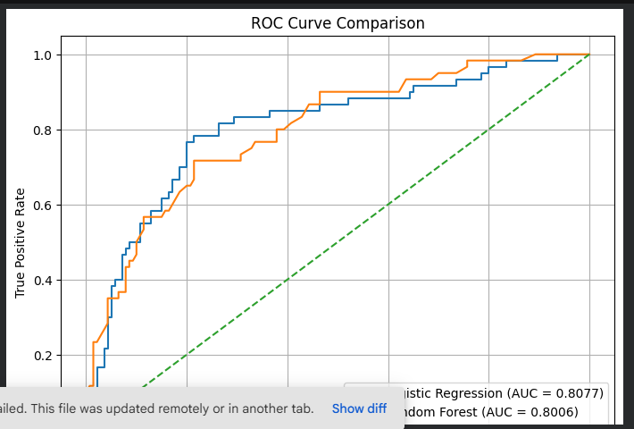

## 📁 Project Structure

```text
CodeAlpha_CreditScoringModel/
│
├── data/
│   └── README.md
│
├── images/
│   ├── credit_risk_distribution.png
│   ├── roc_curve_comparison.png
│   └── feature_importance.png
│
├── models/
│   ├── credit_scoring_model.pkl
│   └── credit_preprocessor.pkl
│
├── notebooks/
│   └── Credit_Scoring_Model.ipynb
│
└── README.md
```

---

## 📊 Visual Results

### Credit Risk Distribution



### ROC Curve Comparison



### Top 15 Important Features


---

## 🏆 Conclusion

The evaluated models show that Logistic Regression achieved the strongest overall performance among the tested models.

The final Logistic Regression model achieved:

* **Accuracy:** 77.50%
* **Precision:** 63.64%
* **Recall:** 58.33%
* **F1-Score:** 60.87%
* **ROC-AUC:** 79.96%

The model and preprocessing object were saved using Joblib for future use.
