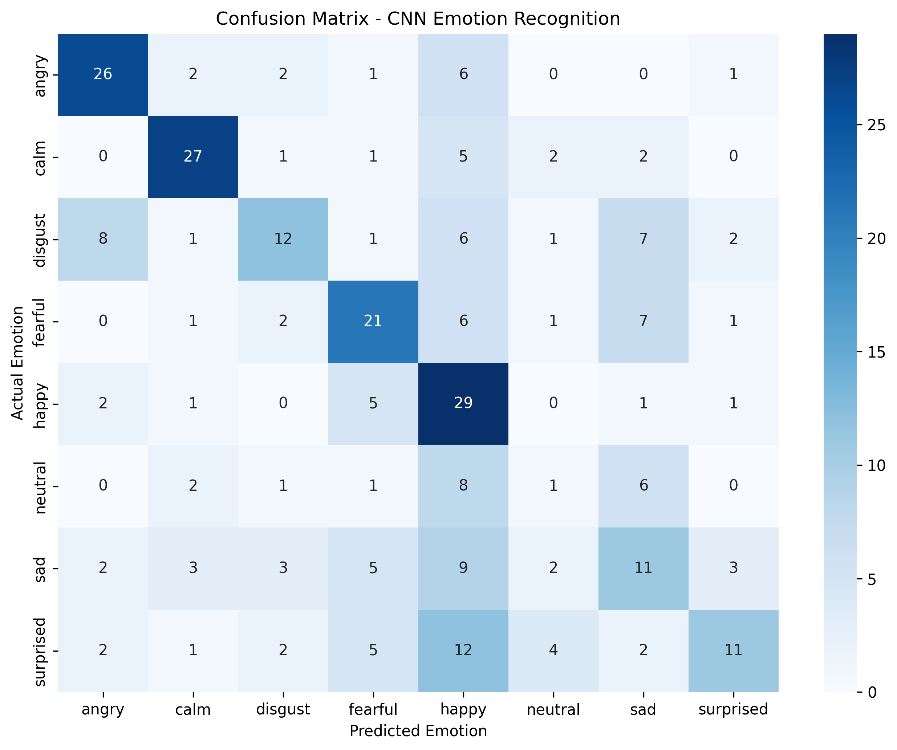
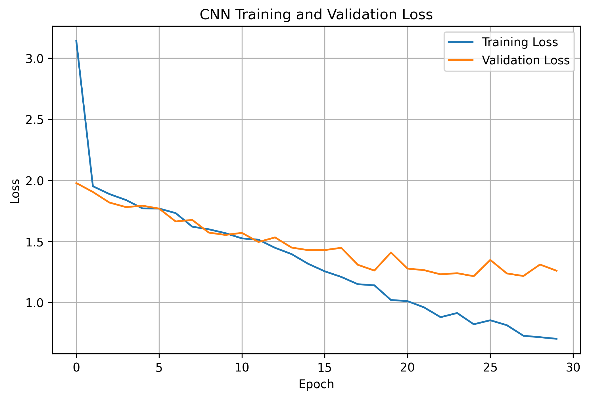

# CodeAlpha Task 2 — Emotion Recognition from Speech

## 📌 Project Overview

This project is completed as part of the **CodeAlpha Machine Learning Internship**.

The objective is to build a speech emotion recognition system that classifies audio recordings into different emotion categories using **MFCC features** and a **Convolutional Neural Network (CNN)**.

## 🎯 Objective

The model recognizes the following emotions:

* Neutral
* Calm
* Happy
* Sad
* Angry
* Fearful
* Disgust
* Surprised

## 📊 Dataset

The project uses the **RAVDESS (Ryerson Audio-Visual Database of Emotional Speech and Song)** dataset.

The audio files are processed using Python and Librosa before extracting MFCC features for machine learning.

## 🔄 Project Workflow

1. Load the RAVDESS audio dataset
2. Extract emotion labels from the audio filenames
3. Load and preprocess the audio files
4. Extract MFCC features
5. Encode the emotion labels
6. Split the data into training and testing sets
7. Prepare the features for CNN input
8. Build and train a 1D CNN model
9. Evaluate the model on the test data
10. Generate performance visualizations
11. Save the trained CNN model

## 🛠️ Technologies Used

* Python
* NumPy
* Pandas
* Librosa
* Matplotlib
* Seaborn
* Scikit-learn
* TensorFlow / Keras
* Google Colab

## 🤖 Machine Learning Model

A **1D Convolutional Neural Network (CNN)** is used for speech emotion classification.

MFCC features extracted from the audio recordings are provided as input to the CNN, which learns patterns associated with different emotional classes.

## 📈 Model Evaluation

The model is evaluated using:

* Test accuracy
* Classification report
* Confusion matrix
* Training accuracy
* Validation accuracy
* Training loss
* Validation loss

The detailed results are available in the Jupyter Notebook.

## 📊 Visual Results

### Confusion Matrix



### Training and Validation Accuracy


### Training and Validation Loss



## 💾 Saved Model

The trained CNN model is saved as:

`emotion_recognition_cnn.h5`

## 📁 Project Structure

```text
task2_emotion_recognition/
│
├── Emotion_Recognition_from_Speech.ipynb
├── emotion_recognition_cnn.h5
├── confusion_matrix_emotion.png
├── accuracy_curve.png
├── loss_curve.png
└── README.md
```

## 🏁 Conclusion

This project demonstrates an end-to-end speech emotion recognition workflow, from audio preprocessing and MFCC feature extraction to CNN-based classification and model evaluation.

The complete implementation and results are provided in the accompanying Jupyter Notebook.
